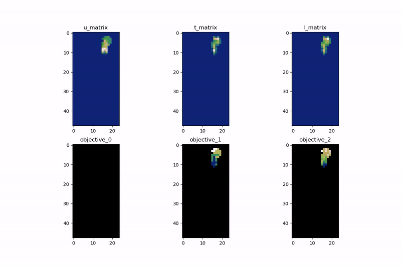

# ROSOMAXA

`ROSOMAXA` stands for Routing Optimizations with Self-Organizing Maps And EXtrAs - a custom algorithm which addresses
the problem of population diversity: ability to retain different individuals in the population and use them as an input
for the search procedure. This is important to prevent premature convergence in local optimum.

## Key ideas

The `rosomaxa` algorithm is based on the following key ideas:

* use Growing Self-Organizing Map to cluster discovered solutions and retain good, but different ones
* choice clustering characteristics which are specific to solution geometry rather to objectives
* use 2D visualization to analyze and understand algorithm behavior

### Clustering

Solution clustering is preformed by custom implementation of [a growing self-organizing map (GSOM)](https://en.wikipedia.org/wiki/Growing_self-organizing_map)
which is a growing variant of a self-organizing map. In `rosomaxa`, it has the following characteristics:

* each node maintains a small population which keeps track of a few solutions selected by elitism approach
* nodes are created and split based on selected solution characteristics, such as:
     - vehicle max load variance
     - standard deviation of the number of customer per tour
     - mean of route durations
     - mean of route distances
     - mean of route waiting times
     - average distance between route medoids
     - amount of routes
* periodically, the network is compacted and rebalanced to keep search analyzing most prominent local optimums

### Visualization

This animation shows some insights how algorithms performs over time:

Here:
* `u_matrix` is unified distance matrix calculated using solution characteristics
* `t_matrix` and `l_matrix` shows how often nodes are updated
* `objective_0`, `objective_1`, `objective_2`: objective values such as amount of unassigned jobs, tours, and cost

## Further research

* experiment with different solution characteristics
* rebalance GSOM parameters based on search progression
* analyze "heat" map dynamically to adjust GSOM parameters
* add control of `exploration` vs `exploitation` ratio